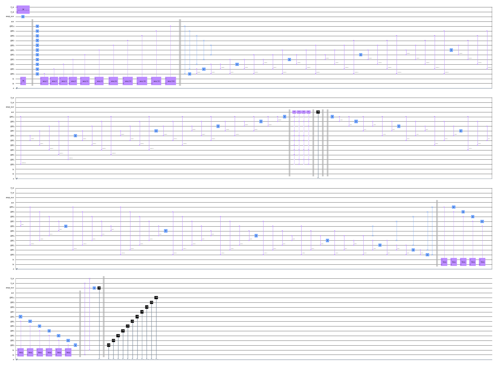

<h3 align="center">Quantum Linear Algebra</h3>

  

    The Harrow–Hassidim–Lloyd (HHL) algorithm  
     
     
    <a href="https://github.com/sonnyloweus">Sonny Lowe</a>
  

## Built With
* [![Python][Python.org]][Python-url]
* [![Jupyter Notebook][Jupyter.org]][Jupyter-url]
* [![Qiskit][Qiskit.org]][Qiskit-url]

[Python.org]: https://img.shields.io/badge/Python-3776AB?style=for-the-badge&logo=python&logoColor=white
[Python-url]: https://www.python.org/

[Jupyter.org]: https://img.shields.io/badge/Jupyter-DA5B0B?style=for-the-badge&logo=jupyter&logoColor=white
[Jupyter-url]: https://jupyter.org/

[Qiskit.org]: https://img.shields.io/badge/Qiskit-6929C4?style=for-the-badge&logo=IBM&logoColor=white
[Qiskit-url]: https://qiskit.org/

(<a href="#readme-top">back to top</a>)
