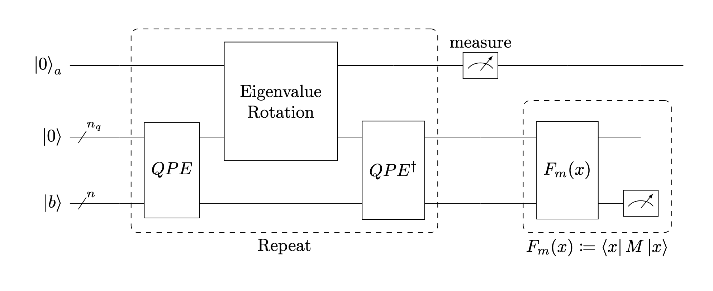

<h3 align="center">Quantum Linear Algebra</h3>

  

    The Harrow–Hassidim–Lloyd (HHL) algorithm  
     
     
    <a href="https://github.com/sonnyloweus">Sonny Lowe</a>
  

This notebook will discuss the Harrow-Hassidim-Lloyd (HHL) quantum algorithm, meant for solving a linear system
$$A\vec{x}=\vec{b} \text{ ,  where } A \text{ is a hermitian matrix}$$
and where $\vec{x}$ and $\vec{b}$ ultimately represent quantum states $\ket{x}$ and $\ket{b}$ respectively. We will provide a derivation, implementation, generalization to non-hermitian matrices, as well as the context for HHL as a subroutine.

Much of the implementations that do exist are hard-coded to specific linear system case studies, which this paper will humbly stray away from in favor of a more self-contained generalized algorithm that fully utilizes the derivations and concepts that HHL employs. To do this, we will walk through different quantum subroutines, which as a sacrafice, increase the query complexity of the system.

Note: we will generally be working in the normalized domain.

## Built With
* [![Python][Python.org]][Python-url]
* [![Jupyter Notebook][Jupyter.org]][Jupyter-url]
* [![Qiskit][Qiskit.org]][Qiskit-url]

[Python.org]: https://img.shields.io/badge/Python-3776AB?style=for-the-badge&logo=python&logoColor=white
[Python-url]: https://www.python.org/

[Jupyter.org]: https://img.shields.io/badge/Jupyter-DA5B0B?style=for-the-badge&logo=jupyter&logoColor=white
[Jupyter-url]: https://jupyter.org/

[Qiskit.org]: https://img.shields.io/badge/Qiskit-6929C4?style=for-the-badge&logo=IBM&logoColor=white
[Qiskit-url]: https://qiskit.org/

(<a href="#readme-top">back to top</a>)
